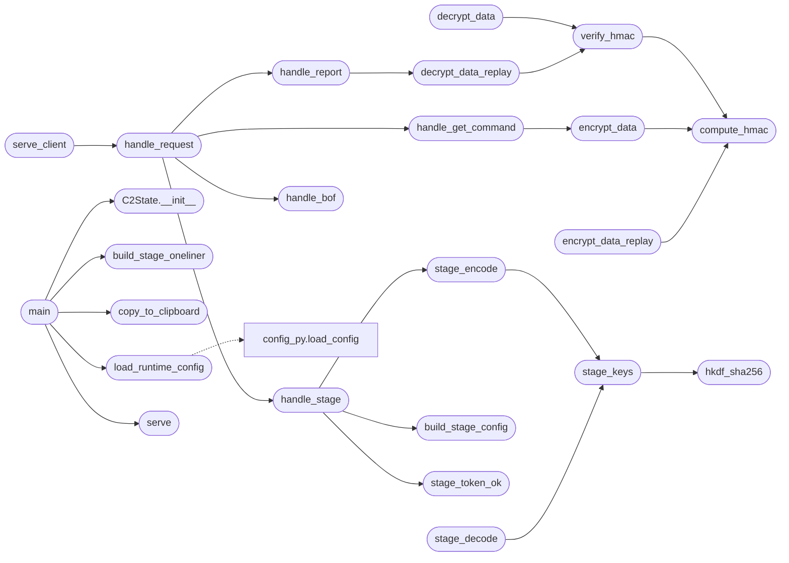

# `c2.server`

> Source: [c2/server.py:1](../../c2/server.py#L1) | language `py` | coverage 96.3% | [API index](../index.md)

Black Sand Beacon C2 Server

Gopher-style command and control server for Black Sand Beacon agents.
Handles command queuing, result collection, and BOF distribution.

Security features:
- Thread pool to prevent resource exhaustion
- HMAC-based message authentication (optional)
- Configurable TLS verification
- Centralized JSON configuration

Usage:
    python3 c2/server.py
    BSB_CONFIG=/path/to/config.json python3 c2/server.py

## Contents

- **Classes:** [`C2State`](#c2state)
- **Functions:** [`load_runtime_config`](#load_runtime_config), [`compute_hmac`](#compute_hmac), [`verify_hmac`](#verify_hmac), [`encrypt_data`](#encrypt_data), [`encrypt_data_replay`](#encrypt_data_replay), [`decrypt_data`](#decrypt_data), [`decrypt_data_replay`](#decrypt_data_replay), [`hkdf_sha256`](#hkdf_sha256), [`stage_keys`](#stage_keys), [`stage_encode`](#stage_encode), [`stage_decode`](#stage_decode), [`stage_token_ok`](#stage_token_ok), [`build_stage_config`](#build_stage_config), [`handle_stage`](#handle_stage), [`build_stage_oneliner`](#build_stage_oneliner), [`copy_to_clipboard`](#copy_to_clipboard), [`handle_get_command`](#handle_get_command), [`handle_report`](#handle_report), [`handle_bof`](#handle_bof), [`handle_request`](#handle_request), [`serve_client`](#serve_client), [`serve`](#serve), [`command_injector`](#command_injector), [`main`](#main)
- **Constants:** [`ROOT`](#root), [`DEFAULTS`](#defaults), [`STAGE_BEACON_PATH`](#stage_beacon_path), [`STAGE_CONFIG_PATH`](#stage_config_path), [`STAGE_BEACON_PREFIX`](#stage_beacon_prefix), [`STAGE_CONFIG_PREFIX`](#stage_config_prefix), [`STAGE_HKDF_SALT`](#stage_hkdf_salt), [`STAGE_HKDF_INFO_ENC`](#stage_hkdf_info_enc), [`STAGE_HKDF_INFO_HMAC`](#stage_hkdf_info_hmac), [`STAGE_PAYLOAD_PATH`](#stage_payload_path), [`MAX_REQUEST`](#max_request)

## Call Graph

Solid arrows stay in this module, dashed arrows leave it.


```mermaid
flowchart LR
    n_c2_server_py__verify_hmac(["verify_hmac"])
    n_c2_server_py__compute_hmac(["compute_hmac"])
    n_c2_server_py__encrypt_data(["encrypt_data"])
    n_c2_server_py__encrypt_data_replay(["encrypt_data_replay"])
    n_c2_server_py__decrypt_data(["decrypt_data"])
    n_c2_server_py__decrypt_data_replay(["decrypt_data_replay"])
    n_c2_server_py__stage_keys(["stage_keys"])
    n_c2_server_py__hkdf_sha256(["hkdf_sha256"])
    n_c2_server_py__stage_encode(["stage_encode"])
    n_c2_server_py__stage_decode(["stage_decode"])
    n_c2_server_py__handle_stage(["handle_stage"])
    n_c2_server_py__build_stage_config(["build_stage_config"])
    n_c2_server_py__stage_token_ok(["stage_token_ok"])
    n_c2_server_py__handle_get_command(["handle_get_command"])
    n_c2_server_py__handle_report(["handle_report"])
    n_c2_server_py__handle_request(["handle_request"])
    n_c2_server_py__handle_bof(["handle_bof"])
    n_c2_server_py__serve_client(["serve_client"])
    n_c2_server_py__main(["main"])
    n_c2_server_py__C2State___init__(["C2State.__init__"])
    n_c2_server_py__build_stage_oneliner(["build_stage_oneliner"])
    n_c2_server_py__copy_to_clipboard(["copy_to_clipboard"])
    n_c2_server_py__load_runtime_config(["load_runtime_config"])
    n_c2_server_py__serve(["serve"])
    n_include_config_py_py__load_config["config_py.load_config"]
    n_c2_server_py__verify_hmac --> n_c2_server_py__compute_hmac
    n_c2_server_py__encrypt_data --> n_c2_server_py__compute_hmac
    n_c2_server_py__encrypt_data_replay --> n_c2_server_py__compute_hmac
    n_c2_server_py__decrypt_data --> n_c2_server_py__verify_hmac
    n_c2_server_py__decrypt_data_replay --> n_c2_server_py__verify_hmac
    n_c2_server_py__stage_keys --> n_c2_server_py__hkdf_sha256
    n_c2_server_py__stage_encode --> n_c2_server_py__stage_keys
    n_c2_server_py__stage_decode --> n_c2_server_py__stage_keys
    n_c2_server_py__handle_stage --> n_c2_server_py__build_stage_config
    n_c2_server_py__handle_stage --> n_c2_server_py__stage_encode
    n_c2_server_py__handle_stage --> n_c2_server_py__stage_token_ok
    n_c2_server_py__handle_get_command --> n_c2_server_py__encrypt_data
    n_c2_server_py__handle_report --> n_c2_server_py__decrypt_data_replay
    n_c2_server_py__handle_request --> n_c2_server_py__handle_bof
    n_c2_server_py__handle_request --> n_c2_server_py__handle_get_command
    n_c2_server_py__handle_request --> n_c2_server_py__handle_report
    n_c2_server_py__handle_request --> n_c2_server_py__handle_stage
    n_c2_server_py__serve_client --> n_c2_server_py__handle_request
    n_c2_server_py__main --> n_c2_server_py__C2State___init__
    n_c2_server_py__main --> n_c2_server_py__build_stage_oneliner
    n_c2_server_py__main --> n_c2_server_py__copy_to_clipboard
    n_c2_server_py__main --> n_c2_server_py__load_runtime_config
    n_c2_server_py__main --> n_c2_server_py__serve
    n_c2_server_py__load_runtime_config -.-> n_include_config_py_py__load_config
```

## Classes

<a id="c2state"></a>

### `C2State`

`class` | [c2/server.py:634](../../c2/server.py#L634)

```python
class C2State
```

Mutable state shared between request handlers.

**Members**

| Member | Kind | Summary |
|---|---|---|
| [`__init__`](#c2state-__init__) | constructor |  |

<a id="c2state-__init__"></a>

#### `C2State.__init__`

`constructor` | [c2/server.py:637](../../c2/server.py#L637)

```python
def __init__(self, cfg: Dict[str, Any])
```

**Parameters**

| Name | Type | Default | Description |
|---|---|---|---|
| `cfg` | `Dict[str, Any]` |  |  |

*Called by:* [`main`](#main)

---

## Functions

<a id="load_runtime_config"></a>

### `load_runtime_config`

`function` | [c2/server.py:160](../../c2/server.py#L160)

```python
def load_runtime_config() -> Dict[str, Any]
```

Load configuration from JSON file or use defaults.

Anything not provided (config.json or environment) is generated at
random *per server run*: port, master key, staging token and client
id. Generated values are recorded in cfg["generated"] so main() can
print them, and they always win over the on-disk file when the
config is served through the staging endpoint.

**Returns:** `Dict[str, Any]`

*Calls:* [`load_config`](include.config_py.py.md#load_config)

*Called by:* [`main`](#main)

---

<a id="compute_hmac"></a>

### `compute_hmac`

`function` | [c2/server.py:287](../../c2/server.py#L287)

```python
def compute_hmac(key: bytes, data: bytes) -> str
```

Compute HMAC-SHA256 for message authentication.

**Parameters**

| Name | Type | Default | Description |
|---|---|---|---|
| `key` | `bytes` |  |  |
| `data` | `bytes` |  |  |

**Returns:** `str`

*Called by:* [`encrypt_data`](#encrypt_data), [`encrypt_data_replay`](#encrypt_data_replay), [`verify_hmac`](#verify_hmac)

---

<a id="verify_hmac"></a>

### `verify_hmac`

`function` | [c2/server.py:292](../../c2/server.py#L292)

```python
def verify_hmac(key: bytes, data: bytes, signature: str) -> bool
```

Verify HMAC-SHA256 signature.

**Parameters**

| Name | Type | Default | Description |
|---|---|---|---|
| `key` | `bytes` |  |  |
| `data` | `bytes` |  |  |
| `signature` | `str` |  |  |

**Returns:** `bool`

*Calls:* [`compute_hmac`](#compute_hmac)

*Called by:* [`decrypt_data`](#decrypt_data), [`decrypt_data_replay`](#decrypt_data_replay)

---

<a id="encrypt_data"></a>

### `encrypt_data`

`function` | [c2/server.py:298](../../c2/server.py#L298)

```python
def encrypt_data(data: bytes, key: bytes, hmac_key: bytes = None, use_hmac: bool = False) -> str
```

Encrypt data with AES-256-CFB and optional HMAC (legacy format without replay protection).

**Parameters**

| Name | Type | Default | Description |
|---|---|---|---|
| `data` | `bytes` |  |  |
| `key` | `bytes` |  |  |
| `hmac_key` | `bytes` | `None` |  |
| `use_hmac` | `bool` | `False` |  |

**Returns:** `str`

*Calls:* [`compute_hmac`](#compute_hmac)

*Called by:* [`handle_get_command`](#handle_get_command)

---

<a id="encrypt_data_replay"></a>

### `encrypt_data_replay`

`function` | [c2/server.py:321](../../c2/server.py#L321)

```python
def encrypt_data_replay(data: bytes, key: bytes, counter: int, timestamp: int, hmac_key: bytes = None, use_hmac: bool = False) -> str
```

Encrypt data with AES-256-CFB and replay protection (counter + timestamp).

**Parameters**

| Name | Type | Default | Description |
|---|---|---|---|
| `data` | `bytes` |  |  |
| `key` | `bytes` |  |  |
| `counter` | `int` |  |  |
| `timestamp` | `int` |  |  |
| `hmac_key` | `bytes` | `None` |  |
| `use_hmac` | `bool` | `False` |  |

**Returns:** `str`

*Calls:* [`compute_hmac`](#compute_hmac)

---

<a id="decrypt_data"></a>

### `decrypt_data`

`function` | [c2/server.py:355](../../c2/server.py#L355)

```python
def decrypt_data(b64_data: str, key: bytes, hmac_key: bytes = None, use_hmac: bool = False) -> Optional[bytes]
```

Decrypt AES-256-CFB data with optional HMAC verification.

**Parameters**

| Name | Type | Default | Description |
|---|---|---|---|
| `b64_data` | `str` |  |  |
| `key` | `bytes` |  |  |
| `hmac_key` | `bytes` | `None` |  |
| `use_hmac` | `bool` | `False` |  |

**Returns:** `Optional[bytes]`

*Calls:* [`verify_hmac`](#verify_hmac)

---

<a id="decrypt_data_replay"></a>

### `decrypt_data_replay`

`function` | [c2/server.py:378](../../c2/server.py#L378)

```python
def decrypt_data_replay(b64_data: str, key: bytes, hmac_key: bytes = None, use_hmac: bool = False, replay_window_seconds: int = 300, last_seen_counter: Dict[str, int] = None, client_id: str = None) -> Optional[tuple[bytes, int, int]]
```

Decrypt AES-256-CFB data with replay protection (counter + timestamp).

Returns (decrypted_data, counter, timestamp) on success, None on failure.

**Parameters**

| Name | Type | Default | Description |
|---|---|---|---|
| `b64_data` | `str` |  |  |
| `key` | `bytes` |  |  |
| `hmac_key` | `bytes` | `None` |  |
| `use_hmac` | `bool` | `False` |  |
| `replay_window_seconds` | `int` | `300` |  |
| `last_seen_counter` | `Dict[str, int]` | `None` |  |
| `client_id` | `str` | `None` |  |

**Returns:** `Optional[tuple[bytes, int, int]]`

*Calls:* [`verify_hmac`](#verify_hmac)

*Called by:* [`handle_report`](#handle_report)

---

<a id="hkdf_sha256"></a>

### `hkdf_sha256`

`function` | [c2/server.py:472](../../c2/server.py#L472)

```python
def hkdf_sha256(ikm: bytes, salt: bytes, info: bytes, length: int = 32) -> bytes
```

RFC 5869 HKDF extract+expand.

Pure stdlib for parity with stager.

**Parameters**

| Name | Type | Default | Description |
|---|---|---|---|
| `ikm` | `bytes` |  |  |
| `salt` | `bytes` |  |  |
| `info` | `bytes` |  |  |
| `length` | `int` | `32` |  |

**Returns:** `bytes`

*Called by:* [`stage_keys`](#stage_keys)

---

<a id="stage_keys"></a>

### `stage_keys`

`function` | [c2/server.py:483](../../c2/server.py#L483)

```python
def stage_keys(token: str) -> tuple[bytes, bytes]
```

Derive staging encryption and HMAC keys from token.

**Parameters**

| Name | Type | Default | Description |
|---|---|---|---|
| `token` | `str` |  |  |

**Returns:** `tuple[bytes, bytes]`

*Calls:* [`hkdf_sha256`](#hkdf_sha256)

*Called by:* [`stage_decode`](#stage_decode), [`stage_encode`](#stage_encode)

---

<a id="stage_encode"></a>

### `stage_encode`

`function` | [c2/server.py:491](../../c2/server.py#L491)

```python
def stage_encode(payload: bytes, token: str) -> bytes
```

Encrypt payload with AES-256-CFB + HMAC-SHA256 using token-derived keys.

**Parameters**

| Name | Type | Default | Description |
|---|---|---|---|
| `payload` | `bytes` |  |  |
| `token` | `str` |  |  |

**Returns:** `bytes`

*Calls:* [`stage_keys`](#stage_keys)

*Called by:* [`handle_stage`](#handle_stage)

---

<a id="stage_decode"></a>

### `stage_decode`

`function` | [c2/server.py:503](../../c2/server.py#L503)

```python
def stage_decode(body: bytes, token: str) -> Optional[bytes]
```

Decrypt/verify staging payload.

Returns None on auth/decrypt failure.

**Parameters**

| Name | Type | Default | Description |
|---|---|---|---|
| `body` | `bytes` |  |  |
| `token` | `str` |  |  |

**Returns:** `Optional[bytes]`

*Calls:* [`stage_keys`](#stage_keys)

---

<a id="stage_token_ok"></a>

### `stage_token_ok`

`function` | [c2/server.py:523](../../c2/server.py#L523)

```python
def stage_token_ok(state: C2State, token: str) -> bool
```

Constant-time token check; fail closed when no token configured.

**Parameters**

| Name | Type | Default | Description |
|---|---|---|---|
| `state` | `C2State` |  |  |
| `token` | `str` |  |  |

**Returns:** `bool`

*Called by:* [`handle_stage`](#handle_stage)

---

<a id="build_stage_config"></a>

### `build_stage_config`

`function` | [c2/server.py:531](../../c2/server.py#L531)

```python
def build_stage_config(state: C2State) -> bytes
```

Build the beacon config JSON served by /stage/config.

Runtime values (random-generated key/port/client id) always win over
the on-disk file, so a fileless beacon agrees with *this* server
run. The server-only section is stripped and derived key bytes are
dropped (not JSON-serializable).

**Parameters**

| Name | Type | Default | Description |
|---|---|---|---|
| `state` | `C2State` |  |  |

**Returns:** `bytes`

*Calls:* [`load_config`](include.config_py.py.md#load_config)

*Called by:* [`handle_stage`](#handle_stage)

---

<a id="handle_stage"></a>

### `handle_stage`

`function` | [c2/server.py:563](../../c2/server.py#L563)

```python
def handle_stage(state: C2State, kind: str, token: str) -> bytes
```

Serve the beacon ELF or the config.json through the staging contract.

**Parameters**

| Name | Type | Default | Description |
|---|---|---|---|
| `state` | `C2State` |  |  |
| `kind` | `str` |  |  |
| `token` | `str` |  |  |

**Returns:** `bytes`

*Calls:* [`build_stage_config`](#build_stage_config), [`stage_encode`](#stage_encode), [`stage_token_ok`](#stage_token_ok)

*Called by:* [`handle_request`](#handle_request)

---

<a id="build_stage_oneliner"></a>

### `build_stage_oneliner`

`function` | [c2/server.py:594](../../c2/server.py#L594)

```python
def build_stage_oneliner(cfg: Dict[str, Any]) -> str
```

Build the copy-paste stager one-liner for the current config.

The stager payload (c2/stage_payload.py) reads URL and token from
environment variables and sends token via Authorization header.

**Parameters**

| Name | Type | Default | Description |
|---|---|---|---|
| `cfg` | `Dict[str, Any]` |  |  |

**Returns:** `str`

*Called by:* [`main`](#main)

---

<a id="copy_to_clipboard"></a>

### `copy_to_clipboard`

`function` | [c2/server.py:611](../../c2/server.py#L611)

```python
def copy_to_clipboard(text: str) -> bool
```

Copy text to the X11/Wayland clipboard; False if no tool exists.

**Parameters**

| Name | Type | Default | Description |
|---|---|---|---|
| `text` | `str` |  |  |

**Returns:** `bool`

*Called by:* [`main`](#main)

---

<a id="handle_get_command"></a>

### `handle_get_command`

`function` | [c2/server.py:650](../../c2/server.py#L650)

```python
def handle_get_command(state: C2State, selector: str) -> bytes
```

Dispatch beacon's polling GET request.

**Parameters**

| Name | Type | Default | Description |
|---|---|---|---|
| `state` | `C2State` |  |  |
| `selector` | `str` |  |  |

**Returns:** `bytes`

*Calls:* [`encrypt_data`](#encrypt_data)

*Called by:* [`handle_request`](#handle_request)

---

<a id="handle_report"></a>

### `handle_report`

`function` | [c2/server.py:674](../../c2/server.py#L674)

```python
def handle_report(state: C2State, b64_payload: str) -> bytes
```

Process beacon result report.

**Parameters**

| Name | Type | Default | Description |
|---|---|---|---|
| `state` | `C2State` |  |  |
| `b64_payload` | `str` |  |  |

**Returns:** `bytes`

*Calls:* [`decrypt_data_replay`](#decrypt_data_replay)

*Called by:* [`handle_request`](#handle_request)

---

<a id="handle_bof"></a>

### `handle_bof`

`function` | [c2/server.py:764](../../c2/server.py#L764)

```python
def handle_bof(state: C2State, name: str) -> bytes
```

Serve BOF file with path traversal protection.

Looks up by basename in configured upload_dir and common locations
(cwd, C2 dir, project root, build/bof) so dropping a .o next to the
server or in build artifacts works out of the box.

**Parameters**

| Name | Type | Default | Description |
|---|---|---|---|
| `state` | `C2State` |  |  |
| `name` | `str` |  |  |

**Returns:** `bytes`

*Called by:* [`handle_request`](#handle_request)

---

<a id="handle_request"></a>

### `handle_request`

`function` | [c2/server.py:811](../../c2/server.py#L811)

```python
def handle_request(state: C2State, selector: str) -> bytes
```

Route request to appropriate handler.

Accepts both the HTTP/1.1 request form (the beacon uses libcurl)
and the bare Gopher-style selector. Payloads carried in an HTTP
path are percent-decoded, since base64 uses '+', '/' and '='
which are not all legal in a request line.

**Parameters**

| Name | Type | Default | Description |
|---|---|---|---|
| `state` | `C2State` |  |  |
| `selector` | `str` |  |  |

**Returns:** `bytes`

*Calls:* [`handle_bof`](#handle_bof), [`handle_get_command`](#handle_get_command), [`handle_report`](#handle_report), [`handle_stage`](#handle_stage)

*Called by:* [`serve_client`](#serve_client)

---

<a id="serve_client"></a>

### `serve_client`

`function` | [c2/server.py:963](../../c2/server.py#L963)

```python
def serve_client(state: C2State, conn: socket.socket, addr: tuple)
```

Handle individual client connection.

**Parameters**

| Name | Type | Default | Description |
|---|---|---|---|
| `state` | `C2State` |  |  |
| `conn` | `socket.socket` |  |  |
| `addr` | `tuple` |  |  |

*Calls:* [`handle_request`](#handle_request)

---

<a id="serve"></a>

### `serve`

`function` | [c2/server.py:993](../../c2/server.py#L993)

```python
def serve(cfg: Dict[str, Any], state: C2State)
```

Bind and accept loop.

Blocks until interrupted.

**Parameters**

| Name | Type | Default | Description |
|---|---|---|---|
| `cfg` | `Dict[str, Any]` |  |  |
| `state` | `C2State` |  |  |

*Called by:* [`main`](#main)

---

<a id="command_injector"></a>

### `command_injector`

`function` | [c2/server.py:1058](../../c2/server.py#L1058)

```python
def command_injector(state: C2State)
```

Interactive command injection REPL.

**Parameters**

| Name | Type | Default | Description |
|---|---|---|---|
| `state` | `C2State` |  |  |

---

<a id="main"></a>

### `main`

`function` | [c2/server.py:1081](../../c2/server.py#L1081)

```python
def main()
```

Start C2 server.

*Calls:* [`C2State.__init__`](#c2state-__init__), [`build_stage_oneliner`](#build_stage_oneliner), [`copy_to_clipboard`](#copy_to_clipboard), [`load_runtime_config`](#load_runtime_config), [`serve`](#serve)

---

## Constants

<a id="root"></a>

### `ROOT`

`constant` | [c2/server.py:42](../../c2/server.py#L42)

```python
ROOT = Path(__file__).resolve().parent.parent
```

---

<a id="defaults"></a>

### `DEFAULTS`

`constant` | [c2/server.py:56](../../c2/server.py#L56)

```python
DEFAULTS
```

---

<a id="stage_beacon_path"></a>

### `STAGE_BEACON_PATH`

`constant` | [c2/server.py:462](../../c2/server.py#L462)

```python
STAGE_BEACON_PATH = '/stage/beacon'
```

---

<a id="stage_config_path"></a>

### `STAGE_CONFIG_PATH`

`constant` | [c2/server.py:463](../../c2/server.py#L463)

```python
STAGE_CONFIG_PATH = '/stage/config'
```

---

<a id="stage_beacon_prefix"></a>

### `STAGE_BEACON_PREFIX`

`constant` | [c2/server.py:465](../../c2/server.py#L465)

```python
STAGE_BEACON_PREFIX = '/stage/beacon/'
```

---

<a id="stage_config_prefix"></a>

### `STAGE_CONFIG_PREFIX`

`constant` | [c2/server.py:466](../../c2/server.py#L466)

```python
STAGE_CONFIG_PREFIX = '/stage/config/'
```

---

<a id="stage_hkdf_salt"></a>

### `STAGE_HKDF_SALT`

`constant` | [c2/server.py:467](../../c2/server.py#L467)

```python
STAGE_HKDF_SALT = b'blacksandbeacon-stage-v2'
```

---

<a id="stage_hkdf_info_enc"></a>

### `STAGE_HKDF_INFO_ENC`

`constant` | [c2/server.py:468](../../c2/server.py#L468)

```python
STAGE_HKDF_INFO_ENC = b'stage-enc'
```

---

<a id="stage_hkdf_info_hmac"></a>

### `STAGE_HKDF_INFO_HMAC`

`constant` | [c2/server.py:469](../../c2/server.py#L469)

```python
STAGE_HKDF_INFO_HMAC = b'stage-hmac'
```

---

<a id="stage_payload_path"></a>

### `STAGE_PAYLOAD_PATH`

`constant` | [c2/server.py:591](../../c2/server.py#L591)

```python
STAGE_PAYLOAD_PATH = Path(__file__).resolve().parent / 'stage_payload.py'
```

---

<a id="max_request"></a>

### `MAX_REQUEST`

`constant` | [c2/server.py:883](../../c2/server.py#L883)

```python
MAX_REQUEST = 65536
```

---
